# Divine Manager ☕

<div align="center">
  
  
  [](https://flutter.dev/)
  [](https://dart.dev/)
  [](LICENSE)
  
  *A custom-built café management solution designed for local coffee shop operations*
</div>

## 📖 Overview

Divine Manager is a specialized Flutter application created for a specific local coffee shop. Unlike generic management systems, this app is carefully tailored to match the exact workflow, menu items, and business processes of a particular café, providing personalized solutions for their daily operations.

## ✨ Features

### 📊 **Real-Time Analytics Dashboard**
- Live sales tracking and performance metrics
- Revenue analysis with growth indicators
- Top-selling items identification
- Custom date range reporting
- Exportable CSV reports

### 📦 **Intelligent Inventory Management**
- Real-time stock tracking
- Low stock alerts and notifications
- Expiry date monitoring
- Batch inventory updates
- Category-based organization

### 🛍️ **Order Processing System**
- Streamlined order placement
- Order history and tracking
- Customer information management
- Revenue calculation
- Order status updates

### 📱 **Modern User Interface**
- Clean, intuitive design
- Dark and light theme support
- Smooth animations and transitions
- Responsive layout for different screen sizes
- Coffee-themed visual elements

## 🏗️ Architecture

Divine Manager follows a clean architecture pattern with:

- **MVVM Pattern**: Clear separation of concerns
- **Riverpod State Management**: Reactive state handling
- **Hive Database**: Local data persistence
- **Feature-Based Structure**: Modular code organization

```
lib/
├── core/
│   ├── pages/          # Core application pages
│   ├── provider/       # Global providers
│   ├── services/       # Core services (Hive, Utils)
│   ├── theme/          # App theming
│   └── widgets/        # Reusable widgets
├── features/
│   ├── analytics/      # Analytics module
│   ├── inventory/      # Inventory management
│   └── order/         # Order processing
└── main.dart          # Application entry point
```

## 🚀 Getting Started

### Prerequisites

- Flutter SDK 3.10.7 or higher
- Dart 3.0 or higher
- Android Studio / VS Code
- Git

### Installation

1. **Clone the repository**
   ```bash
   git clone https://github.com/iamthetwodigiter/DivineManager.git
   cd DivineManager
   ```

2. **Install dependencies**
   ```bash
   flutter pub get
   ```

3. **Generate Hive adapters**
   ```bash
   flutter packages pub run build_runner build
   ```

4. **Run the application**
   ```bash
   flutter run
   ```

## 📦 Dependencies

### Core Dependencies
- **flutter_riverpod** ^3.1.0 - State management
- **hive_flutter** ^1.1.0 - Local database
- **fl_chart** ^1.1.1 - Charts and analytics
- **animate_do** ^4.2.0 - Animations
- **share_plus** ^12.0.1 - File sharing
- **url_launcher** ^6.3.0 - External URL handling

### Development Dependencies
- **hive_generator** ^2.0.1 - Code generation
- **build_runner** ^2.4.13 - Build automation
- **flutter_lints** ^6.0.0 - Code analysis

## 💾 Data Storage

The app uses **Hive** for local data persistence:

- **Orders**: Complete order history and details
- **Inventory**: Real-time stock information
- **Analytics**: Cached performance data

All data is stored locally on the device, ensuring fast access and offline functionality.

## 📊 Analytics Features

- **Revenue Tracking**: Daily, weekly, monthly, and yearly reports
- **Sales Analytics**: Best-performing items and trends
- **Inventory Insights**: Stock levels and reorder recommendations
- **Custom Reports**: Exportable data in CSV format
- **Growth Metrics**: Performance comparison over time

## 🎨 Design System

- **Color Scheme**: Coffee-inspired brown and cream palette
- **Typography**: Lato font family for clean readability
- **Icons**: Material Design icons with custom coffee-themed additions
- **Animations**: Smooth transitions using animate_do package

## 🔧 Configuration

### Theme Customization
The app's theme can be customized in `lib/core/theme/app_theme.dart`:

```dart
class AppTheme {
  static const Color primaryColor = Color(0xFF8B4513);
  static const Color primaryBrown = Color(0xFF6F4E37);
  // ... additional color definitions
}
```

### Adding New Menu Items
To add new inventory items, update the models in:
- `lib/features/inventory/model/inventory_item.dart`

## 🤝 Contributing

This project is specifically designed for a local coffee shop. However, if you'd like to adapt it for your own use:

1. Fork the repository
2. Create a feature branch
3. Make your changes
4. Test thoroughly
5. Submit a pull request

## 📄 License

This project is licensed under the MIT License - see the [LICENSE](LICENSE) file for details.

## 👨‍💻 Developer

**thetwodigiter**
- GitHub: [@iamthetwodigiter](https://github.com/iamthetwodigiter)
- Project: Custom café management solution

## 🎯 Project Goals

Divine Manager was created to:
- Streamline daily café operations
- Reduce manual tracking errors
- Provide actionable business insights
- Improve customer service efficiency
- Support local business growth

## 📱 App Screenshots & Features

<div align="center">

### 🏠 Home Dashboard & Core Navigation
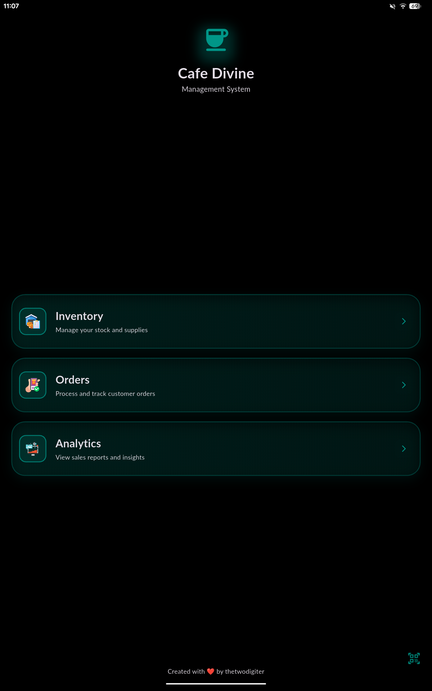

*Clean, intuitive interface providing quick access to all café management functions with coffee-themed design elements*

---

### 📊 Analytics & Business Intelligence

<table>
  <tr>
    <td align="center" width="33%">
      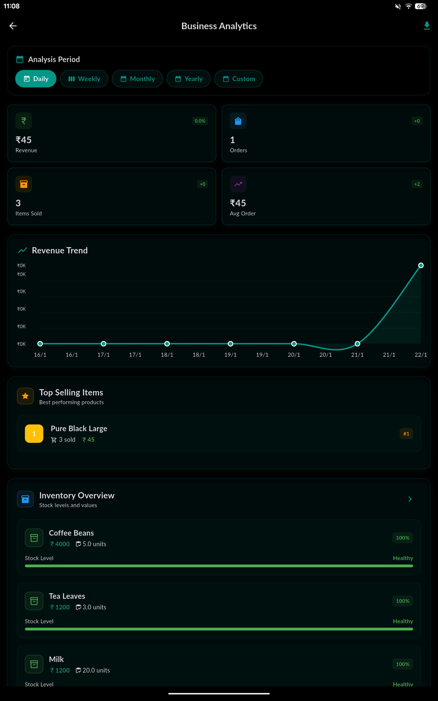<br>
      <b>📈 Revenue Analytics</b><br>
      <sub>Track performance metrics & growth</sub>
    </td>
    <td align="center" width="33%">
      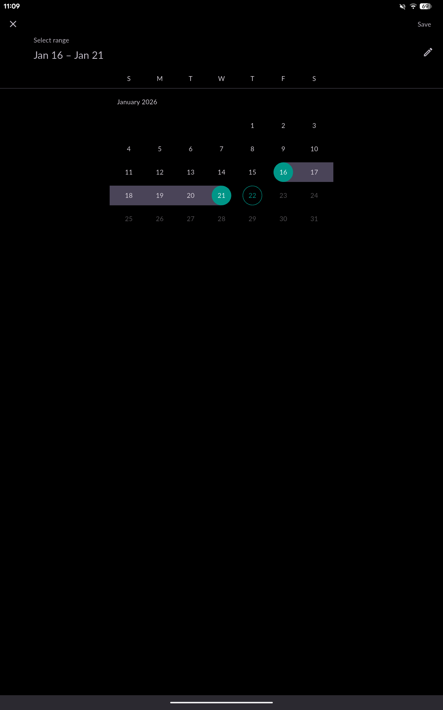<br>
      <b>📅 Custom Reports</b><br>
      <sub>Flexible date range analysis</sub>
    </td>
    <td align="center" width="33%">
      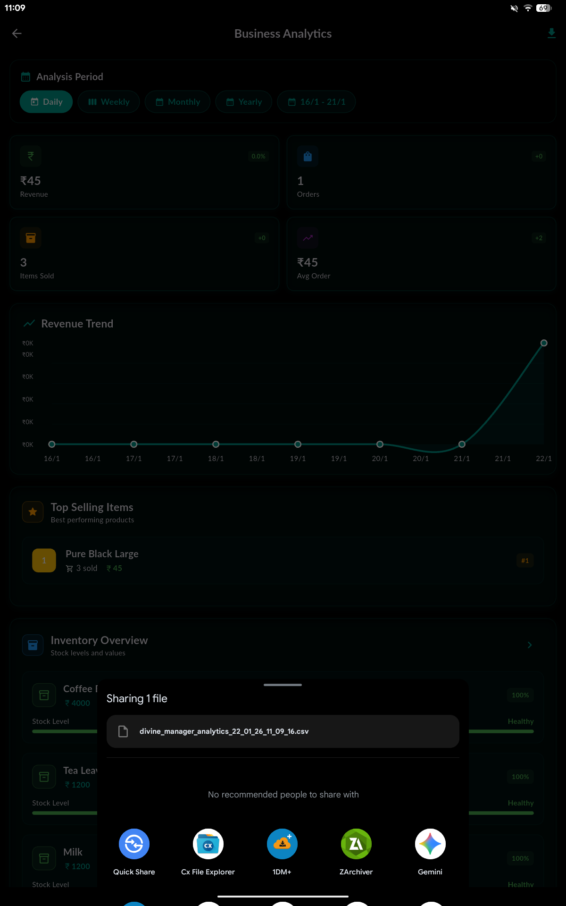<br>
      <b>💾 Data Export</b><br>
      <sub>CSV reports for detailed analysis</sub>
    </td>
  </tr>
</table>

**📊 Analytics Highlights:**
• Real-time revenue tracking with growth indicators  
• Interactive charts showing sales trends and patterns  
• Top-selling items identification with performance metrics  
• Custom date range reporting for flexible analysis  
• One-click CSV export for external data processing

---

### 📦 Inventory Management System

<table>
  <tr>
    <td align="center" width="25%">
      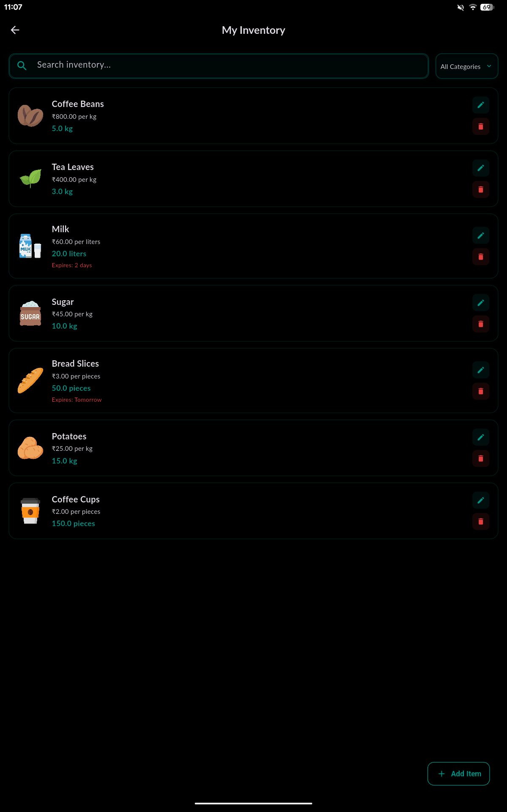<br>
      <b>📋 Stock Overview</b><br>
      <sub>Real-time inventory tracking</sub>
    </td>
    <td align="center" width="25%">
      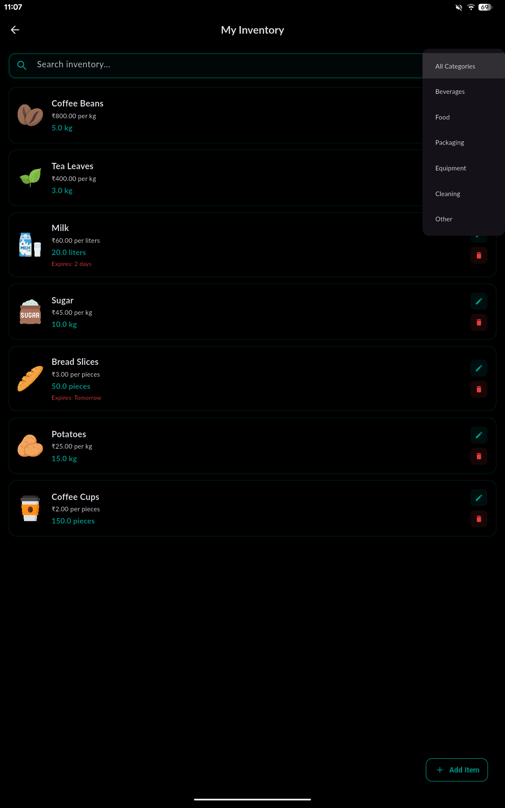<br>
      <b>🏷️ Category Filter</b><br>
      <sub>Organized by item types</sub>
    </td>
    <td align="center" width="25%">
      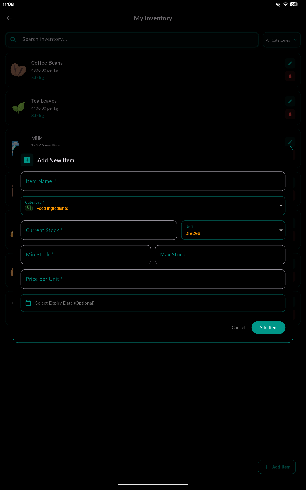<br>
      <b>➕ Add Items</b><br>
      <sub>Quick item registration</sub>
    </td>
    <td align="center" width="25%">
      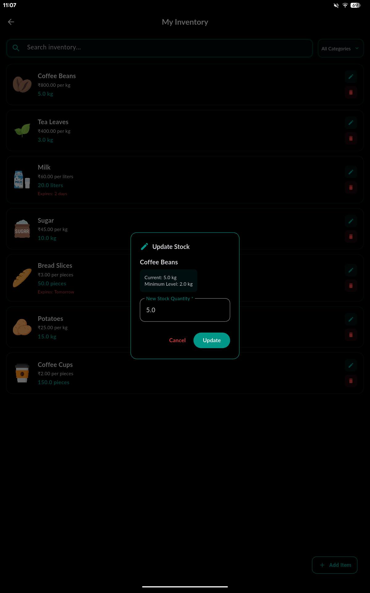<br>
      <b>✏️ Update Stock</b><br>
      <sub>Easy quantity adjustments</sub>
    </td>
  </tr>
</table>

**📦 Inventory Features:**
• Live stock level monitoring with low-stock alerts  
• Expiry date tracking with color-coded warnings  
• Category-based organization (Coffee, Food, Supplies, Equipment)  
• Batch operations for efficient inventory updates  
• Intuitive add/edit dialogs with validation

---

### 🛍️ Order Processing & Menu Management

<table>
  <tr>
    <td align="center" width="25%">
      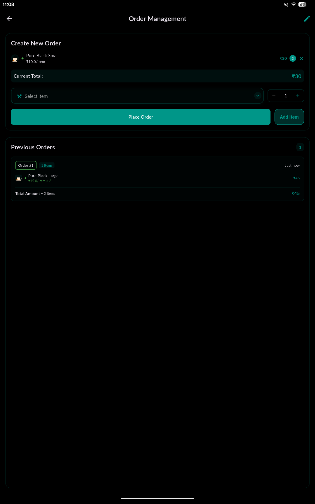<br>
      <b>☕ Order System</b><br>
      <sub>Streamlined order placement</sub>
    </td>
    <td align="center" width="25%">
      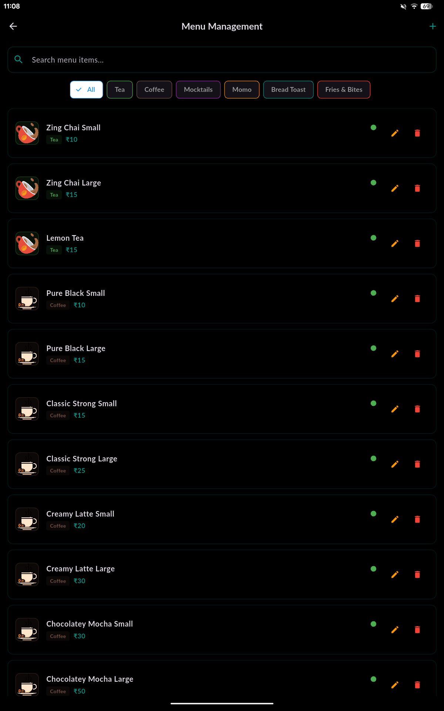<br>
      <b>📋 Menu Control</b><br>
      <sub>Comprehensive menu management</sub>
    </td>
    <td align="center" width="25%">
      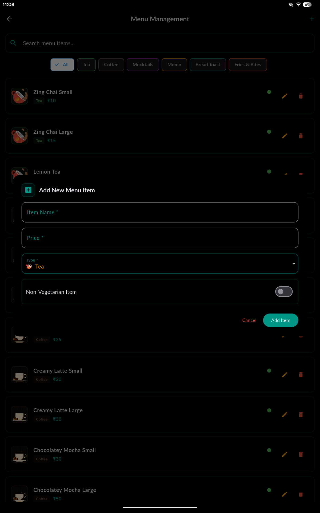<br>
      <b>🍽️ Add Items</b><br>
      <sub>New menu item creation</sub>
    </td>
    <td align="center" width="25%">
      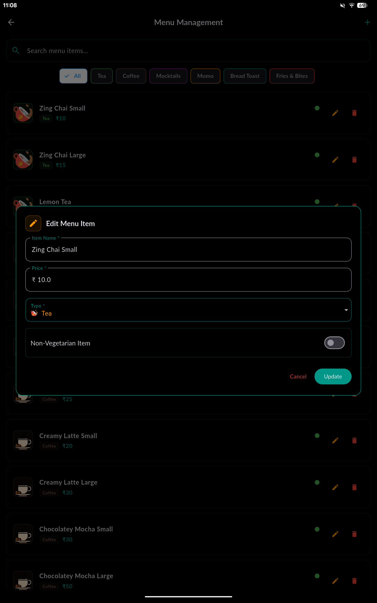<br>
      <b>🔧 Update Menu</b><br>
      <sub>Edit pricing & details</sub>
    </td>
  </tr>
</table>

**🛍️ Order Features:**
• Category-wise menu browsing with visual item cards  
• Real-time cart management with quantity controls  
• Automatic total calculation including taxes  
• Complete order history and customer tracking  
• Professional receipt generation with business details

---

### 🔧 System Operations & Data Safety

<table>
  <tr>
    <td align="center">
      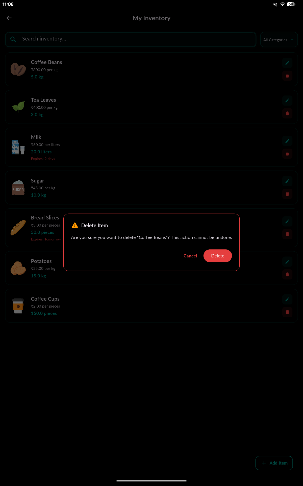<br>
      <b>⚠️ Data Protection</b><br>
      <sub>Confirmation dialogs prevent accidental deletions and ensure data safety</sub>
    </td>
  </tr>
</table>

**🛡️ Safety Features:**
• Confirmation dialogs for critical operations  
• Data validation throughout the application  
• Local Hive database with reliable persistence  
• Automatic backup suggestions for important data

</div>

---

### 🎨 **Design Philosophy**

Divine Manager combines **functionality with aesthetics**, featuring:
- ☕ **Coffee-inspired color palette** creating a warm, familiar atmosphere
- 🌓 **Adaptive theming** that works perfectly in any lighting condition  
- ✨ **Smooth animations** that guide users through workflows naturally
- 📱 **Mobile-first design** optimized for tablet and phone usage
- 🎯 **Intuitive navigation** that café staff can master quickly

> **Real-world tested interface designed specifically for fast-paced café environments**

## 🔄 Version History

- **v1.1.0** - UI/UX Enhancement Update
  - Redesigned order detail dialog with improved layout
  - Implemented filter chips for payment method and status selection
  - Fixed overflow issues and improved responsive design
  - Standardized button styling with 12px border radius
  - Complete theme compliance (removed hardcoded colors)
  - Enhanced visual feedback and user interactions

- **v1.0.0** - Initial release with core features
  - Analytics dashboard
  - Inventory management
  - Order processing
  - Export functionality

> 📝 For detailed changelog, see [UPDATE.md](UPDATE.md)

---

<div align="center">
  <sub>Built with ❤️ and ☕ for Café Divine</sub>
</div>
